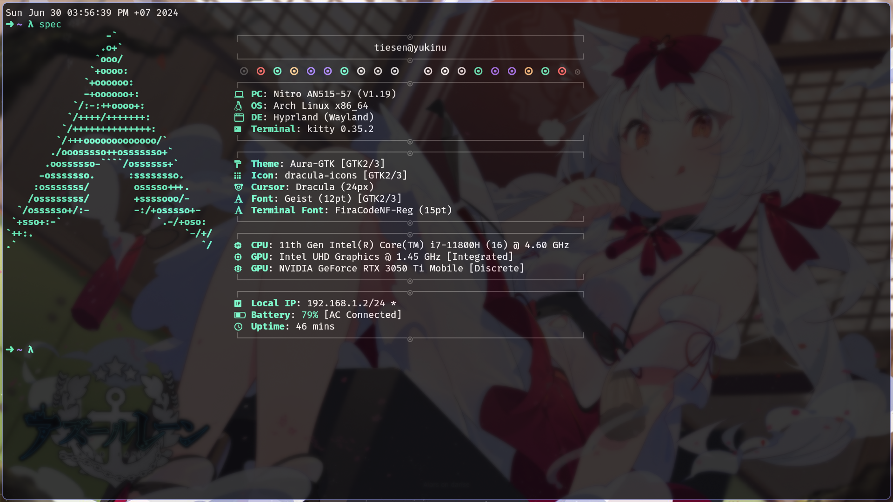

# My arch linux config with Hyprland

## Preview



## Installation

1. Install `yay`

```bash
pacman -Syu --needed git base-devel
git clone https://aur.archlinux.org/yay.git ~/yay
cd ~/yay
makepkg -si
rm -rf ~/yay
```

3. Install all packages

```bash
yay -S zsh fastfetch rofi-wayland hyprpaper hyprpicker hypridle hyprlock \
noto-fonts noto-fonts-cjk noto-fonts-emoji \
zen-browser-bin ffmpeg \
lsd ripgrep brightnessctl \
github-cli lazygit\
cliphist wl-clipboard \
nwg-look pavucontrol \
lazygit unzip \
grim slurp
```

4. Install `oh-my-zsh`

```bash
sh -c "$(curl -fsSL https://raw.githubusercontent.com/ohmyzsh/ohmyzsh/master/tools/install.sh)"
```

> Remember to choose `zsh` as your default shell

Then, install zsh plugins

```bash
git clone https://github.com/zsh-users/zsh-syntax-highlighting.git ${ZSH_CUSTOM:-~/.oh-my-zsh/custom}/plugins/zsh-syntax-highlighting
git clone https://github.com/zsh-users/zsh-autosuggestions ${ZSH_CUSTOM:-~/.oh-my-zsh/custom}/plugins/zsh-autosuggestions
```

5. Optional: Install some stuffs

- UV (Python package manager)

```bash
curl -LsSf https://astral.sh/uv/install.sh | sh
```

- NVM (Node Version Manager)

```bash
curl -o- https://raw.githubusercontent.com/nvm-sh/nvm/v0.40.0/install.sh | bash
```

6. Uninstall unnecessary packages (optional)

```bash
sudo pacman -Runs htop nano vim wofi
```

## Usage

1. To apply my config, you can run the following command:

```bash
rm ~/.zshrc
rm -rf ~/.config/{dunst,fastfetch,hypr,kitty,lazygit,nvim,rofi}

ln -s ~/dotfiles/{dunst,fastfetch,hypr,kitty,lazygit,nvim,rofi} ~/.config
ln -s ~/dotfiles/zsh/themes/yuki.zsh-theme ~/.oh-my-zsh/custom/themes
ln -s ~/dotfiles/zsh/config.zsh ~/.zshrc
```

Then, you can change the themes by `nwg-look` command

2. Change Wallpaper in `~/dotfiles/hypr/misc/hyprpaper.conf`

```bash
$path = /path/to/your/wallpaper
```

Or change file in `~/dotfiles/assets/_background.png`

> [!TIP]
> If windows display wrong time when dual boot, run this command:

```bash
timedatectl set-local-rtc 1
```

## Conclusion

This is my personal config for my arch linux system. You can use it as a reference or clone it to your system. If you have any question, feel free to ask me.

My blog: [here](https://tiesen.id.vn/blogs/arch-linux-hyprland-setup/)

## License

This project is licensed under the MIT License - see the [LICENSE](LICENSE) file for details
