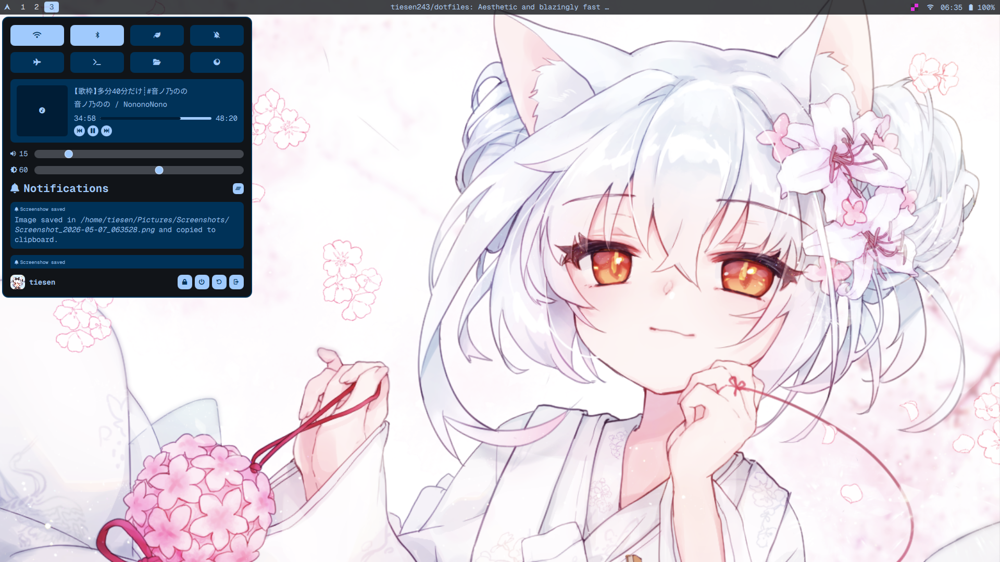
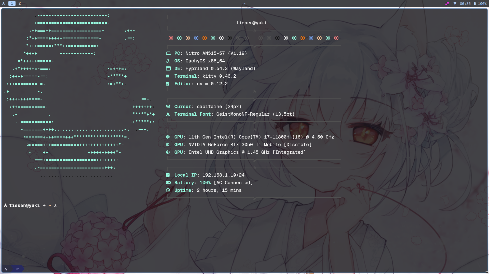
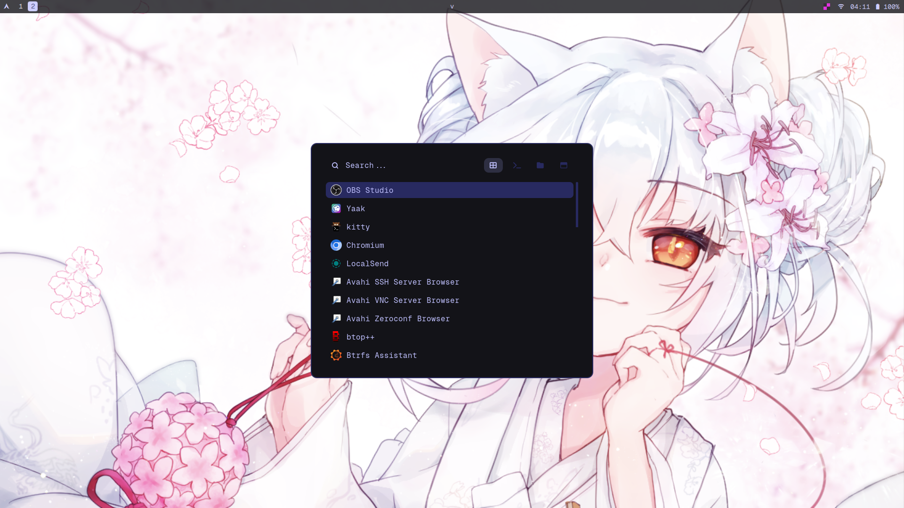
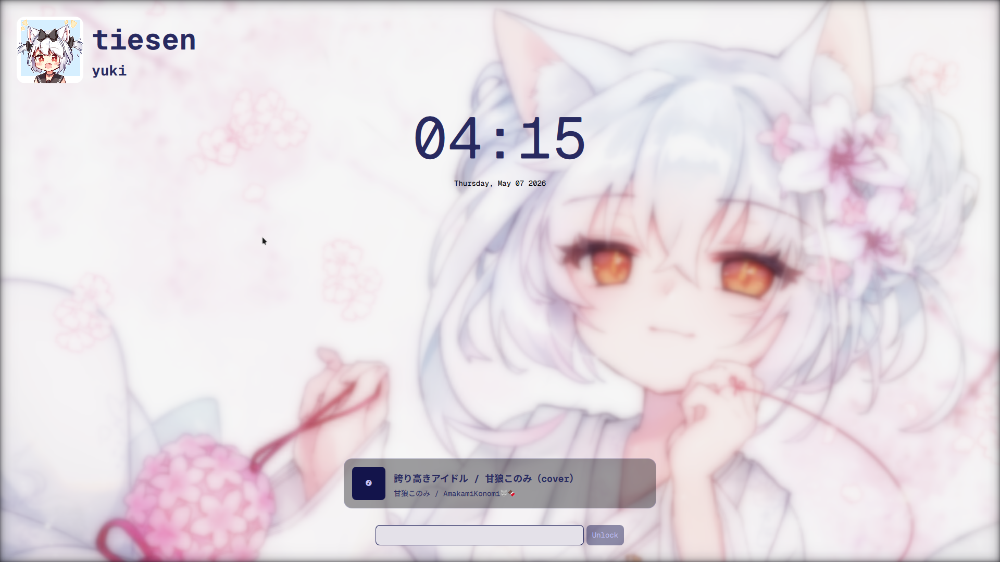
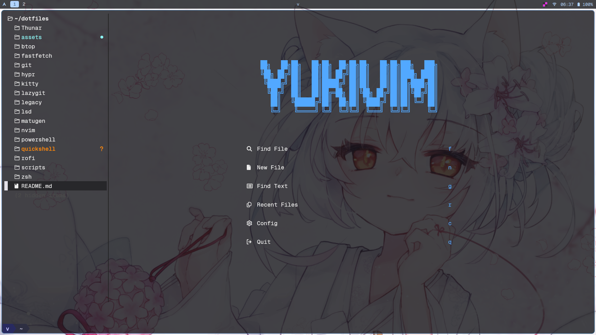

# Arch Linux / CachyOS config with Hyprland

This repository contains my personal dotfiles for configuring Linux. The setup uses Hyprland as the primary desktop environment (Wayland compositor) and Quickshell for building custom desktop components.

## Preview

https://github.com/user-attachments/assets/335b0dc0-46db-4cf3-91a2-a33d711e60d3

### Overview




### Kitty terminal



### App launcher



### Clipboard manager



### Lock screen



### Neovim


## Installation

You can easily set up everything using the automated installation script, or follow the breakdown steps below to do it manually.

### Automated One-Liner (Recommended)

To download and run the installer automatically, copy and paste the following command into your terminal.

```bash
curl -fsSL https://raw.githubusercontent.com/tiesen243/dotfiles/main/install.sh | bash
```

### 1. Install `yay` and necessary packages

```bash
pacman -Syu --needed git base-devel
git clone https://aur.archlinux.org/yay.git ~/yay
cd ~/yay
makepkg -si
rm -rf ~/yay
```

```bash
yay -S --needed --noconfirm --answerclean All --answerdiff --None $(grep -v '^#' ~/dotfiles/package.txt)
```

- Set `zsh` as the default shell

  ```bash
  chsh -s $(which zsh)
  ```

- Open the browser and login to your github account, then run the following command to set up the SSH key for your github account.

  ```bash
  gh auth login
  ```

## Usage

### 1. To apply my config, you can run the following command:

1.1. For Linux

```bash
git clone git@github.com:tiesen243/dotfiles.git ~/dotfiles
```

Then, create the symbolic links to the config files

```bash
rm -rf ~/{.cache,.local,.zshrc}
rm -rf ~/.config/{Thunar,btop,fastfetch,git,gtk-3.0,gtk-4.0,hypr,kitty,lazygit,lsd,matugen,nvim,quickshell,zsh}
ln -s ~/dotfiles/{Thunar,btop,fastfetch,git,gtk-3.0,gtk-4.0,hypr,kitty,lazygit,lsd,matugen,nvim,quickshell,zsh} ~/.config

# For who like lowercase stuffs
rm -rf ~/{Desktop,Documents,Downloads,Music,Pictures,Projects,Public,Templates,Videos} && mkdir -p ~/{documents,downloads,pictures,projects,videos}
ln -s ~/dotfiles/user-dirs.dirs ~/.config && xdg-user-dirs-update
```

Final, make all scripts in the `dotfiles/scripts` directory executable:

```bash
sudo chmod +x ~/dotfiles/scripts/*
```

1.2. For Windows

```powershell
git clone git clone git@github.com:tiesen243/dotfiles.git $HOME\dotfiles
```

Then, create the symbolic links to the config files (make sure to run Terminal as administrator)

```powershell
Remove-Item -Force -Recurse $HOME\Documents\WindowsPowerShell
Remove-Item -Force -Recurse $HOME\AppData\Local\nvim

New-Item -ItemType SymbolicLink -Path $HOME\Documents\WindowsPowerShell -Target $HOME\dotfiles\powershell
New-Item -ItemType SymbolicLink -Path $HOME\AppData\Local\nvim -Target $HOME\dotfiles\nvim
```

### 2. Change Wallpaper

Add your preferred wallpapers to ~/dotfiles/assets/wallpapers/. You can then toggle the wallpaper selector by open the Start Menu using Super+A and click the Wallpaper Selector icon (located at the bottom-right corner of the quick action buttons). After changing the wallpaper, it automatically generates color schemes based on the wallpaper and applies it to the system by using Matugen.

### 3. Add your avatar to `/usr/share/sddm/faces/$USER.face.icon` to show in the lock screen

## Conclusion

This is my personal config for my arch linux system. You can use it as a reference or clone it to your system. If you have any question, feel free to ask me.

My blog: [here](https://tiesen.id.vn/blogs/arch-linux-hyprland-setup/)

## License

This project is licensed under the MIT License - see the [LICENSE](LICENSE) file for details
