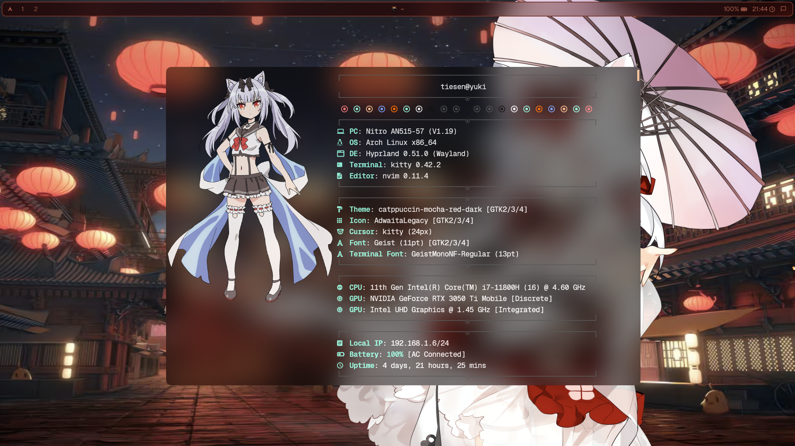
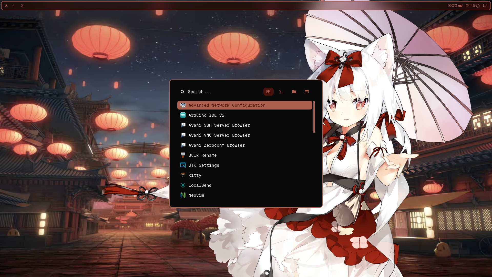
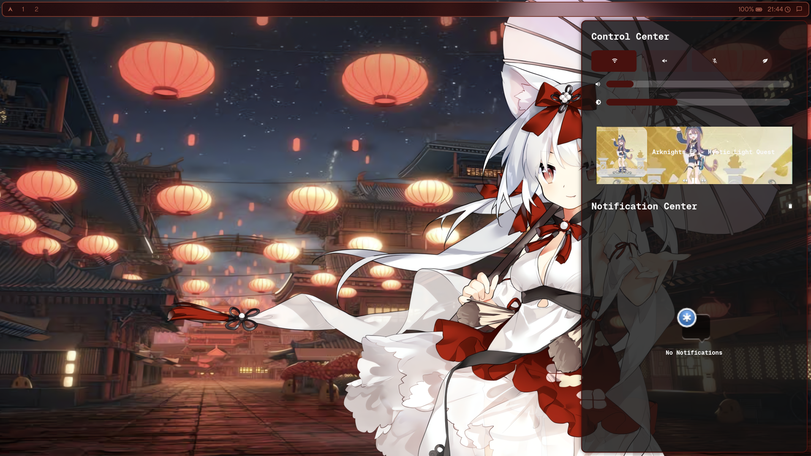
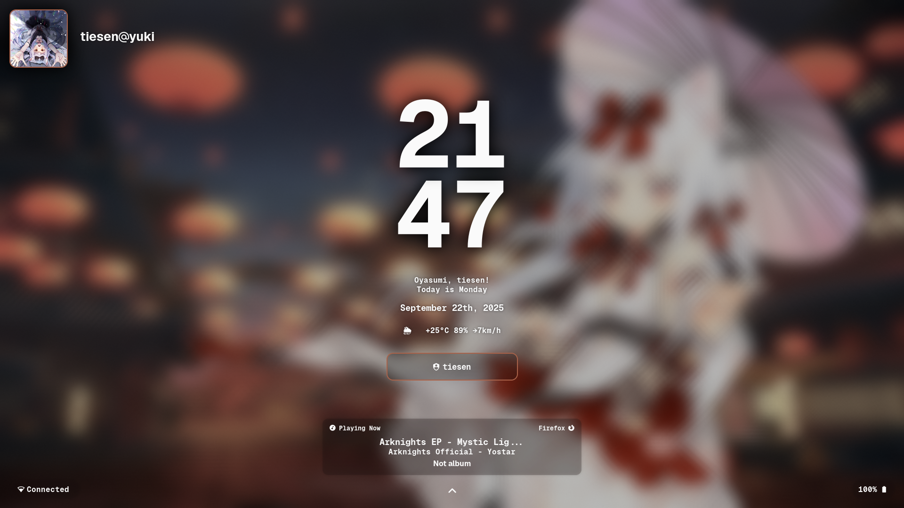
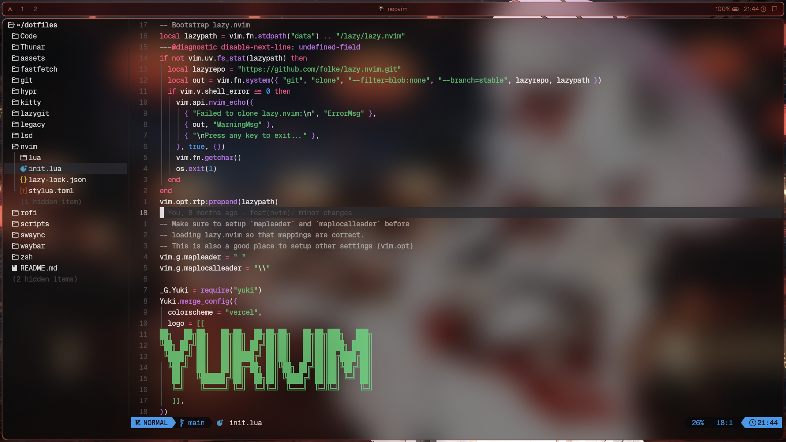

# My arch linux config with Hyprland

## Preview

### Hyprland + Waybar + Kitty




### Rofi




## Notification center



### Hyprlock



## Neovim



## Installation

1. Install `yay`

```bash
pacman -Syu --needed git base-devel
git clone https://aur.archlinux.org/yay.git ~/yay
cd ~/yay
makepkg -si
rm -rf ~/yay
```

3. Install all packages

```bash
yes | yay -S --answerclean All --answerdiff None \
  hypridle hyprlock hyprpaper hyprpicker xdg-desktop-portal-hyprland-git rofi-wayland waybar ffmpeg \
  fastfetch zsh brightnessctl nwg-look playerctl libnotify swaync system76-power \
  noto-fonts noto-fonts-cjk noto-fonts-emoji otf-geist otf-geist-mono-nerd \
  github-cli lazygit lsd ripgrep unzip 7zip \
  grim slurp jq cliphist wl-clipboard \
  thunar gvfs tumbler
```

4. Install `oh-my-zsh`

```bash
sh -c "$(curl -fsSL https://raw.githubusercontent.com/ohmyzsh/ohmyzsh/master/tools/install.sh)"
```

> Remember to choose `zsh` as your default shell

Then, install zsh plugins

```bash
git clone https://github.com/zsh-users/zsh-syntax-highlighting.git ${ZSH_CUSTOM:-~/.oh-my-zsh/custom}/plugins/zsh-syntax-highlighting
git clone https://github.com/zsh-users/zsh-autosuggestions ${ZSH_CUSTOM:-~/.oh-my-zsh/custom}/plugins/zsh-autosuggestions
```

5. Optional: Install some stuffs

- UV (Python package manager)

```bash
curl -LsSf https://astral.sh/uv/install.sh | sh
```

- NVM (Node Version Manager)

```bash
curl -o- https://raw.githubusercontent.com/nvm-sh/nvm/v0.40.0/install.sh | bash
```

6. Set up github

Open the browser and login to your github account, then run the following command to set up the SSH key for your github account.

```bash
gh auth login
```

7. Uninstall unnecessary packages (optional)

```bash
sudo pacman -Runs dunst htop nano vim wofi
```

## Usage

1. To apply my config, you can run the following command:

   ```bash
   git clone git@github.com:tiesen243/dotfiles.git ~/dotfiles
   ```

   Then, create the symbolic links to the config files

   ```bash
   rm ~/.zshrc
   rm -rf ~/.config/{Code,Thunar,fastfetch,git,hypr,kitty,lazygit,lsd,nvim,rofi,swaync,waybar}

   ln -s ~/dotfiles/{Code,Thunar,fastfetch,git,hypr,kitty,lazygit,lsd,nvim,rofi,swaync,waybar} ~/.config
   ln -s ~/dotfiles/zsh/themes/yuki.zsh-theme ~/.oh-my-zsh/custom/themes
   ln -s ~/dotfiles/zsh/config.zsh ~/.zshrc

   ln -s ~/dotfiles/.local/share/{icons,themes} ~/.local/share
   ```

   Final, make all scripts in the dotfiles/scripts directory executable

   ```bash
   sudo chmod +x ~/dotfiles/scripts/*
   ```

2. Change Wallpaper in `~/dotfiles/hypr/hyprpaper.conf`

   ```bash
   $path = /path/to/your/wallpaper
   ```

   Or change file in `~/dotfiles/assets/_background.png`

3. Add your avatar to `~/dotfiles/assets/_avatar.png` to show in the lock screen
4. Enable `system76-power` service

   ```bash
   systemctl enable --now com.system76.PowerDaemon.service
   ```

## Conclusion

This is my personal config for my arch linux system. You can use it as a reference or clone it to your system. If you have any question, feel free to ask me.

My blog: [here](https://tiesen.id.vn/blogs/arch-linux-hyprland-setup/)

## License

This project is licensed under the MIT License - see the [LICENSE](LICENSE) file for details
