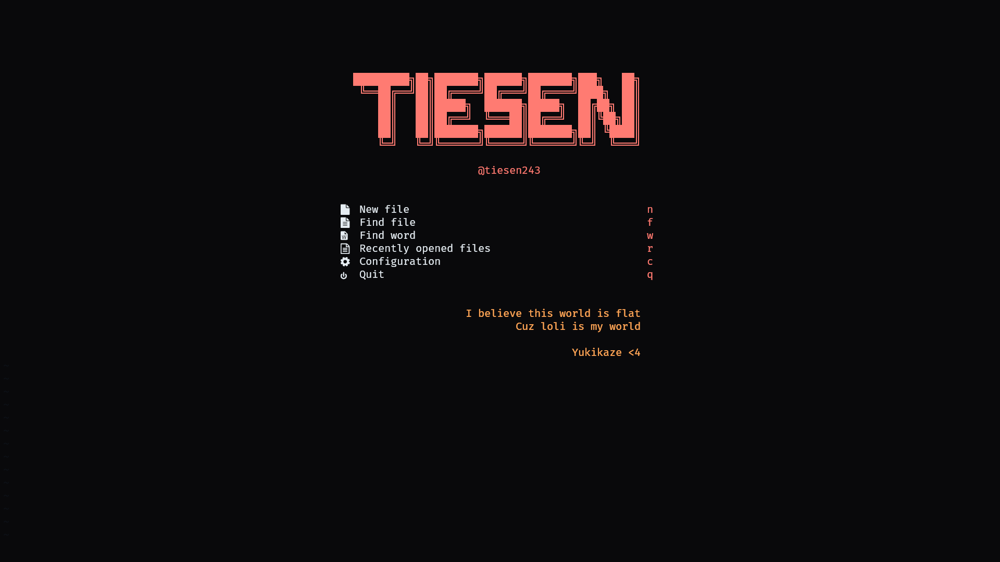

# My Neovim Config



## Features

1. **LSP** (Language Server Protocol) support
2. **CMP** for autocompletion
3. **Copilot** for code suggestion
4. **Treesitter** for syntax highlighting
5. **Telescope** for fuzzy finding
6. and more...

## Requirements

1. Install nerd-font at [here](https://www.nerdfonts.com/font-downloads) and set it as your terminal font (I use FiraCode Nerd Font)
2. Install fzf, fd, ripgrep

```bash
# Ubuntu
sudo apt install fzf fd-find ripgrep

# Arch
sudo pacman -S fzf fd ripgrep

# MacOS
brew install fzf fd ripgrep

# Windows (with scoop)
scoop install fzf fd ripgrep
```

## Installation

> Windows

```bash
git clone git@github.com:tiesen243/nvim.git $env:LOCALAPPDATA\nvim
```

> Linux

```bash
git clone git@github.com:tiesen243/nvim.git ~/.config/nvim
```

**Note**

1. The default `<leader>` shortcut is `<space>` (you can change it in `lua/core/lazy.lua`)

## License

This project is licensed under the MIT License - see the [LICENSE](LICENSE) file for details
